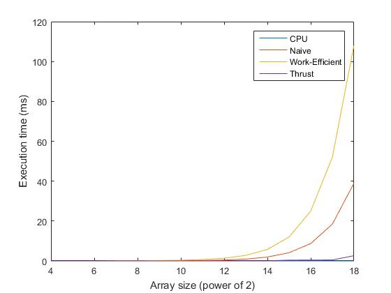
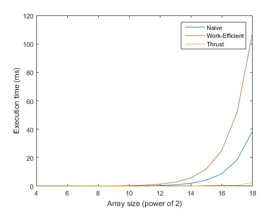
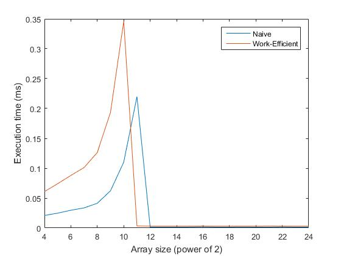

CUDA Stream Compaction
======================

**University of Pennsylvania, CIS 565: GPU Programming and Architecture, Project 2**

* Tongbo Sui
* Tested on: Windows 10, i5-3320M @ 2.60GHz 8GB, NVS 5400M 2GB (Personal)

## Project description

* Scan:
  * CPU scan & compaction
  * Naive scan
  * Work-efficient scan & compaction

* Radix sort:
  * A single block/tile implementation of radix sort. Splitting and merging are not implemented
  * Call the function as: `count = RadixSort::sort(SIZE, c, a, 8);`
  * The function will simply write sorted result to the result array, and return the array size.

### Optimize block size
Block size is optimized based on fixed array size (256) and number of blocks. `[1,2,4,8,16]` blocks are tested on each implementation
  * Naive scan: 4 blocks / 64 threads has the best execution time
  * Work efficient scan: 2 blocks / 128 threads has the best execution time

### Performance
All 4 implementations are ran on various array sizes from `2^4` to `2^18`. Due to memory constraints bigger array sizes are not available.

  * All performances



  * Exclude CPU



  * Naive vs. Work-efficient



* Observations
  * Theoretically work-efficient scan should be faster than a naive scan. However somehow this is not the case in performance testing with small array sizes. A profile report shows the following which might contribute to the result:
    * Up-sweep is generating 100% more memory transactions than a naive scan. Adding down-sweep process, work-efficient method has about 150% more than naive method.
    * Up-sweep is executing 50% more integer operations than naive method.
    * In general work-efficient method has 8% divergence, while naive method has none.
    * In general naive implementation has a better Occupancy Per SM rate, in term of number of its active blocks against device limit. All these could contribute to a faster execution of naive scan, compared to current work-efficient implementation.
  * Thrust seems to have the best performance among GPU implementations. From Nsight timeline we can see that it is splitting the problem into tiles and doing work-efficient scan. Thrust runs in 40 blocks with 128 threads each, which accounts for a size of 5120, which is about `2^12`. When array size grows big, building tiles and merging results would be a major bottleneck.
  * As array size grows, GPU hardware resources get saturated. More blocks can only be scheduled sequentially, thereby reducing the performance significantly. On the other hand, issue efficiency drops, resulting in wasted cycles.
  * With almost 0% cache hit rate, as array size increases, more and more time is needed for memory I/O operations.
  * With all of the factors above combined, the CPU implementation is actually much faster than GPU in the final result. C++11 `chrono` library was only able to pick up the execution time in milliseconds when the CPU code is ran in another nested for-loop for about `2^8` times. The guess is that CPU can still have the best performance up to a point, where linear computation cost outweighs memory I/O time.

* Test program output
  * The extra output `XXX scan: 0.0000000` is used for profiling the execution time of each implementation
  * Radix sort test is also printed, where the test is carried out on the array generated in stream compaction test, and compared against standard C++ vector sort
  * Performance comparision is also printed. All 4 implementations are ran on various array sizes from `2^4` to `2^18`

```
****************
** SCAN TESTS **
****************
    [  38  19  38  37   5  47  15  35   0  12   3   0  42 ...  26   0 ]
==== cpu scan, power-of-two ====
    [   0  38  57  95 132 137 184 199 234 234 246 249 249 ... 6203 6229 ]
==== cpu scan, non-power-of-two ====
    [   0  38  57  95 132 137 184 199 234 234 246 249 249 ... 6146 6190 ]
    passed
==== naive scan, power-of-two ====
Naive scan: 0.042304
    passed
==== naive scan, non-power-of-two ====
Naive scan: 0.041088
    passed
==== work-efficient scan, power-of-two ====
Work-efficient scan: 0.127552
    passed
==== work-efficient scan, non-power-of-two ====
Work-efficient scan: 0.126304
    passed
==== thrust scan, power-of-two ====
Thrust scan: 3.756288
    passed
==== thrust scan, non-power-of-two ====
Thrust scan: 0.016544
    passed

*****************************
** STREAM COMPACTION TESTS **
*****************************
    [   2   3   2   1   3   1   1   1   2   0   1   0   2 ...   0   0 ]
==== cpu compact without scan, power-of-two ====
    [   2   3   2   1   3   1   1   1   2   1   2   1   1 ...   2   1 ]
    passed
==== cpu compact without scan, non-power-of-two ====
    [   2   3   2   1   3   1   1   1   2   1   2   1   1 ...   3   2 ]
    passed
==== cpu compact with scan ====
    [   2   3   2   1   3   1   1   1   2   1   2   1   1 ...   2   1 ]
    passed
==== work-efficient compact, power-of-two ====
Work-efficient scan: 0.125088
    passed
==== work-efficient compact, non-power-of-two ====
Work-efficient scan: 0.125120
    passed

*****************************
** RADIX SORT (Single block/tile) TEST **
*****************************
Thrust scan: 0.016512
Thrust scan: 0.015072
Thrust scan: 0.014912
Thrust scan: 0.015008
Thrust scan: 0.014912
Thrust scan: 0.014944
Thrust scan: 0.015008
Thrust scan: 0.019840
Radix sort:
    [   0   0   0   0   0   0   0   0   0   0   0   0   0 ...   3   3 ]
Std sort:
    [   0   0   0   0   0   0   0   0   0   0   0   0   0 ...   3   3 ]
    passed

*****************************
** SCAN PERFORMANCE **
*****************************
==== Array size: 16 ====
CPU scan: 0.000000
Naive scan: 0.001536
Work-efficient scan: 0.003136
Thrust scan: 0.016672

==== Array size: 32 ====
CPU scan: 0.000000
Naive scan: 0.001536
Work-efficient scan: 0.003040
Thrust scan: 0.016512

==== Array size: 64 ====
CPU scan: 0.000000
Naive scan: 0.029120
Work-efficient scan: 0.003104
Thrust scan: 0.016416

==== Array size: 128 ====
CPU scan: 0.000000
Naive scan: 0.033376
Work-efficient scan: 0.111296
Thrust scan: 0.016512

==== Array size: 256 ====
CPU scan: 0.000000
Naive scan: 0.041056
Work-efficient scan: 0.126304
Thrust scan: 0.016512

==== Array size: 512 ====
CPU scan: 0.000000
Naive scan: 0.063456
Work-efficient scan: 0.194720
Thrust scan: 0.016736

==== Array size: 1024 ====
CPU scan: 0.000000
Naive scan: 0.112128
Work-efficient scan: 0.352768
Thrust scan: 0.017056

==== Array size: 2048 ====
CPU scan: 0.000000
Naive scan: 0.216704
Work-efficient scan: 0.685760
Thrust scan: 0.020064

==== Array size: 4096 ====
CPU scan: 0.000000
Naive scan: 0.439424
Work-efficient scan: 1.365280
Thrust scan: 0.024992

==== Array size: 8192 ====
CPU scan: 0.000000
Naive scan: 0.915264
Work-efficient scan: 2.785376
Thrust scan: 0.038912

==== Array size: 16384 ====
CPU scan: 0.000000
Naive scan: 1.931072
Work-efficient scan: 5.762080
Thrust scan: 0.067264

==== Array size: 32768 ====
CPU scan: 0.000000
Naive scan: 4.107552
Work-efficient scan: 11.998688
Thrust scan: 0.393440

==== Array size: 65536 ====
CPU scan: 0.000000
Naive scan: 8.706624
Work-efficient scan: 24.970079
Thrust scan: 0.439232

==== Array size: 131072 ====
CPU scan: 0.000000
Naive scan: 18.445057
Work-efficient scan: 51.995682
Thrust scan: 0.477088

==== Array size: 262144 ====
CPU scan: 0.000000
Naive scan: 38.985985
Work-efficient scan: 108.208801
Thrust scan: 2.610464
```

## Submit

If you have modified any of the `CMakeLists.txt` files at all (aside from the
list of `SOURCE_FILES`), you must test that your project can build in Moore
100B/C. Beware of any build issues discussed on the Google Group.

1. Open a GitHub pull request so that we can see that you have finished.
   The title should be "Submission: YOUR NAME".
2. Send an email to the TA (gmail: kainino1+cis565@) with:
   * **Subject**: in the form of `[CIS565] Project 2: PENNKEY`
   * Direct link to your pull request on GitHub
   * In the form of a grade (0-100+) with comments, evaluate your own
     performance on the project.
   * Feedback on the project itself, if any.
