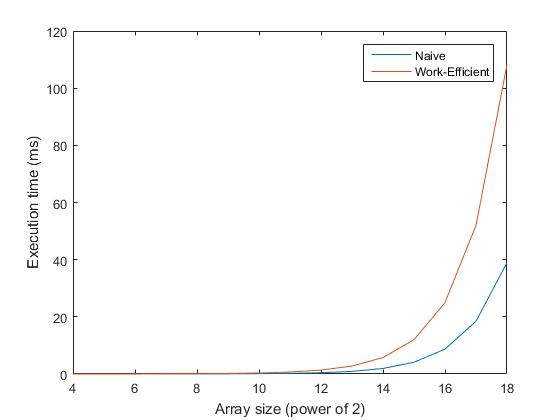

CUDA Stream Compaction
======================

**University of Pennsylvania, CIS 565: GPU Programming and Architecture, Project 2**

* Tongbo Sui
* Tested on: Windows 10, i5-3320M @ 2.60GHz 8GB, NVS 5400M 2GB (Personal)

## Project feature

* Add a description of this project including a list of its features

* Radix sort

```
count = RadixSort::sort(SIZE, c, a, 8);
```

### Questions

* Roughly optimize the block sizes of each of your implementations for minimal
  run time on your GPU.
  * Naive scan:
    * 1:m - 1:256
    * 2:m/2 - 2:128
    * 4:m/4 - 4:64 !!!
    * 8:m/8 - 8:32
    * 16:m/16 - 16:16
  * Work efficient scan: 2:m/2 0.1117824 !!!

* Performance
  * All performances


  * Exclude CPU


  * Naive vs. Work-efficient


* Write a brief explanation of the phenomena you see here.
  * Can you find the performance bottlenecks? Is it memory I/O? Computation? Is
    it different for each implementation?

* Test program output
  * The extra output `XXX scan: 0.0000000` is used for profiling the execution time of each implementation
  * Radix sort test is also printed, where the test is carried out on the array generated in stream compaction test, and compared against standard C++ vector sort
  * Performance comparision is also printed. All 4 implementations are ran on various array sizes from `2^4` to `2^24`

```
****************
** SCAN TESTS **
****************
    [  38  19  38  37   5  47  15  35   0  12   3   0  42 ...  26   0 ]
==== cpu scan, power-of-two ====
    [   0  38  57  95 132 137 184 199 234 234 246 249 249 ... 6203 6229 ]
==== cpu scan, non-power-of-two ====
    [   0  38  57  95 132 137 184 199 234 234 246 249 249 ... 6146 6190 ]
    passed
==== naive scan, power-of-two ====
Naive scan: 0.042400
    passed
==== naive scan, non-power-of-two ====
Naive scan: 0.041088
    passed
==== work-efficient scan, power-of-two ====
Work-efficient scan: 0.127552
    passed
==== work-efficient scan, non-power-of-two ====
Work-efficient scan: 0.126624
    passed
==== thrust scan, power-of-two ====
Thrust scan: 3.615200
    passed
==== thrust scan, non-power-of-two ====
Thrust scan: 0.016640
    passed

*****************************
** STREAM COMPACTION TESTS **
*****************************
    [   2   3   2   1   3   1   1   1   2   0   1   0   2 ...   0   0 ]
==== cpu compact without scan, power-of-two ====
    [   2   3   2   1   3   1   1   1   2   1   2   1   1 ...   2   1 ]
    passed
==== cpu compact without scan, non-power-of-two ====
    [   2   3   2   1   3   1   1   1   2   1   2   1   1 ...   3   2 ]
    passed
==== cpu compact with scan ====
    [   2   3   2   1   3   1   1   1   2   1   2   1   1 ...   2   1 ]
    passed
==== work-efficient compact, power-of-two ====
Work-efficient scan: 0.125120
    passed
==== work-efficient compact, non-power-of-two ====
Work-efficient scan: 0.125248
    passed

*****************************
** RADIX SORT (Single block/tile) TEST **
*****************************
Thrust scan: 0.016576
Thrust scan: 0.014912
Thrust scan: 0.014976
Thrust scan: 0.015008
Thrust scan: 0.015008
Thrust scan: 0.014912
Thrust scan: 0.014912
Thrust scan: 0.015008
Radix sort:
    [   0   0   0   0   0   0   0   0   0   0   0   0   0 ...   3   3 ]
Std sort:
    [   0   0   0   0   0   0   0   0   0   0   0   0   0 ...   3   3 ]
    passed

*****************************
** SCAN PERFORMANCE **
*****************************
==== Array size: 16 ====
CPU scan: 0.000000
Naive scan: 0.020928
Work-efficient scan: 0.060864
Thrust scan: 0.017600

==== Array size: 32 ====
CPU scan: 0.000000
Naive scan: 0.024800
Work-efficient scan: 0.074144
Thrust scan: 0.016416

==== Array size: 64 ====
CPU scan: 0.000000
Naive scan: 0.029664
Work-efficient scan: 0.087968
Thrust scan: 0.016736

==== Array size: 128 ====
CPU scan: 0.000000
Naive scan: 0.033600
Work-efficient scan: 0.101184
Thrust scan: 0.016480

==== Array size: 256 ====
CPU scan: 0.000000
Naive scan: 0.041376
Work-efficient scan: 0.126336
Thrust scan: 0.016608

==== Array size: 512 ====
CPU scan: 0.000000
Naive scan: 0.062336
Work-efficient scan: 0.193728
Thrust scan: 0.016672

==== Array size: 1024 ====
CPU scan: 0.000000
Naive scan: 0.110176
Work-efficient scan: 0.346016
Thrust scan: 0.017088

==== Array size: 2048 ====
CPU scan: 0.000000
Naive scan: 0.219840
Work-efficient scan: 0.003296
Thrust scan: 0.020192

==== Array size: 4096 ====
CPU scan: 0.000000
Naive scan: 0.001504
Work-efficient scan: 0.003008
Thrust scan: 0.025056

==== Array size: 8192 ====
CPU scan: 0.000000
Naive scan: 0.001504
Work-efficient scan: 0.003040
Thrust scan: 0.038944

==== Array size: 16384 ====
CPU scan: 0.000000
Naive scan: 0.001536
Work-efficient scan: 0.003040
Thrust scan: 0.067168

==== Array size: 32768 ====
CPU scan: 0.000000
Naive scan: 0.001600
Work-efficient scan: 0.003072
Thrust scan: 0.363552

==== Array size: 65536 ====
CPU scan: 0.000000
Naive scan: 0.001888
Work-efficient scan: 0.003136
Thrust scan: 0.449568

==== Array size: 131072 ====
CPU scan: 0.000000
Naive scan: 0.001536
Work-efficient scan: 0.003008
Thrust scan: 0.446400

==== Array size: 262144 ====
CPU scan: 0.000000
Naive scan: 0.001536
Work-efficient scan: 0.003040
Thrust scan: 0.649120

==== Array size: 524288 ====
CPU scan: 0.000000
Naive scan: 0.001696
Work-efficient scan: 0.003008
Thrust scan: 0.912192

==== Array size: 1048576 ====
CPU scan: 15630.000000
Naive scan: 0.001536
Work-efficient scan: 0.003072
Thrust scan: 1.351296

==== Array size: 2097152 ====
CPU scan: 15627.000000
Naive scan: 0.001536
Work-efficient scan: 0.003168
Thrust scan: 2.192576

==== Array size: 4194304 ====
CPU scan: 0.000000
Naive scan: 0.001792
Work-efficient scan: 0.003072
Thrust scan: 4.034496

==== Array size: 8388608 ====
CPU scan: 31247.000000
Naive scan: 0.001536
Work-efficient scan: 0.003040
Thrust scan: 7.794240

==== Array size: 16777216 ====
CPU scan: 46879.000000
Naive scan: 0.001504
Work-efficient scan: 0.003104
Thrust scan: 15.012032
```

## Submit

If you have modified any of the `CMakeLists.txt` files at all (aside from the
list of `SOURCE_FILES`), you must test that your project can build in Moore
100B/C. Beware of any build issues discussed on the Google Group.

1. Open a GitHub pull request so that we can see that you have finished.
   The title should be "Submission: YOUR NAME".
2. Send an email to the TA (gmail: kainino1+cis565@) with:
   * **Subject**: in the form of `[CIS565] Project 2: PENNKEY`
   * Direct link to your pull request on GitHub
   * In the form of a grade (0-100+) with comments, evaluate your own
     performance on the project.
   * Feedback on the project itself, if any.
